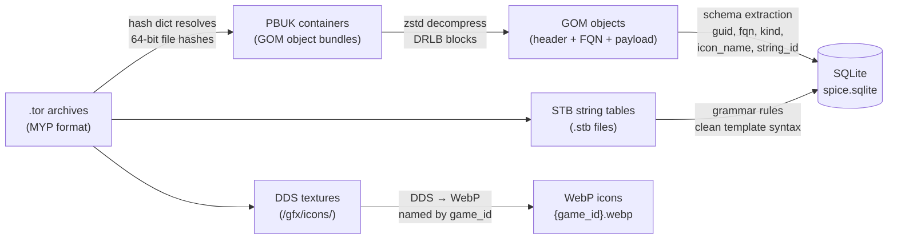

# Kessel

SWTOR data miner — extracts game objects, localized strings, and icons from `.tor` archives into SQLite.

Named after the spice mines of Kessel.

## What it does

Kessel reads SWTOR's `.tor` archive files and produces:

- **SQLite database** with 260k+ game objects (abilities, items, NPCs, quests, talents, and more)
- **558k+ localized strings** extracted from STB string tables
- **WebP icons** converted from DDS textures, named by deterministic `game_id`

Descriptions are automatically cleaned via embedded grammar rules that strip SWTOR's template syntax (`<<1[%d seconds/%d second/%d seconds]>>` → natural English).

## Quick start

```bash
cargo build --release

./target/release/kessel \
  --input ~/swtor/Assets \
  --output spice.sqlite \
  --icons \
  --icons-output ./icons
```

The hash dictionary auto-downloads from Jedipedia on first run. See [docs/cli.md](docs/cli.md) for all flags.

## Data pipeline



## Output

### Database tables

Core: `objects`, `strings`

Quest graph: `quest_details`, `quest_chain`, `quest_npcs`, `quest_phases`, `quest_prerequisites`, `quest_rewards`

Missions: `missions`, `mission_npcs`, `mission_rewards`

Disciplines: `disciplines`, `discipline_abilities`, `talent_abilities`

Other: `conquest_objectives`, `spawn_runtime_ids`, `meta`

Views: `abilities`, `items`, `npcs`, `quests`, `phases`, `quest_descriptions`, `bonus_missions`, `conquest_invasion_bonuses`, `conquest_theme_strings`

See [docs/schema.md](docs/schema.md) for full column definitions and join patterns.

### Icons

```
icons/
  abilities/   {game_id}.webp
  items/       {game_id}.webp
  talents/     {game_id}.webp
```

## Project structure

```
kessel/
  Cargo.toml
  grammar.toml          # Description cleanup rules (embedded at compile time)
  icon_overrides.toml   # FQN → icon_name overrides for abilities without embedded icon refs
  docs/
    cli.md              # CLI flags and examples
    schema.md           # Full database schema reference
  src/
    main.rs             # CLI entry point and extraction pipeline
    lib.rs              # Library exports
    myp.rs              # MYP archive reader (.tor files)
    pbuk.rs             # PBUK/DBLB parser (GOM objects)
    stb.rs              # STB string table parser
    db.rs               # SQLite (batch inserts, grammar application, derived tables)
    dds.rs              # DDS to WebP conversion
    hash.rs             # Hash dictionary and game_id computation
    grammar.rs          # Template/literal/cleanup rule processor
    icon_overrides.rs   # Compile-time FQN → icon_name override map
    gifts.rs            # Gift item FQN classification
    unknowns.rs         # Unknown pattern tracking
    schema/mod.rs       # GameObject struct and binary payload extraction
    bin/
      dump_npp.rs       # Debug utility: dump GOM objects by FQN prefix or exact match
  tests/
```

## License

MIT
