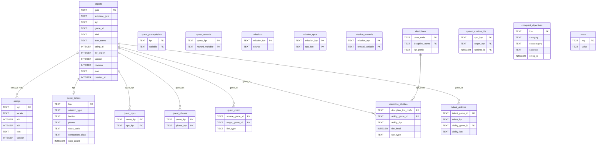

# Database Schema

## Overview



## Core tables

### objects

Every game object extracted from GOM payloads. The single source of truth for all abilities, items, NPCs, quests, talents, and other types.

| Column | Type | Description |
|--------|------|-------------|
| `guid` | TEXT PK | 16-char uppercase hex from GOM header bytes 0–7 (LE u64). Unique per object. |
| `template_guid` | TEXT | 16-char hex from header bytes 16–23. Constant per kind (~99% of the time). |
| `fqn` | TEXT | Fully qualified name, e.g. `abl.sith_warrior.force_charge`. Dot-separated, prefix determines kind. |
| `game_id` | TEXT | `sha256(fqn:guid)[0:16]`. Deterministic compound ID used for icon filenames and frontend lookups. |
| `kind` | TEXT | Object type: `Ability`, `Item`, `Npc`, `Quest`, `Talent`, `Phase`, `Codex`, `Achievement`, `Conversation`, `Encounter`, `Spawn`, `Placeable` |
| `icon_name` | TEXT | SWTOR DDS basename (without `.dds`). Matched to icon files during extraction. NULL if no icon found. |
| `string_id` | INTEGER | Links to `strings.id2` for localized name/description lookup. |
| `for_export` | INTEGER | 1 = include in consumer exports, 0 = internal only. |
| `json` | TEXT | Full extracted metadata as JSON. Includes `fqn`, `header_hex`, `payload_b64`, `strings`, `string_id`. |
| `created_at` | INTEGER | Unix epoch at insert time. |

**Views:** `abilities`, `items`, `npcs`, `quests`, `phases` — each filters `objects` by kind.

### strings

Localized text extracted from STB string tables.

| Column | Type | Description |
|--------|------|-------------|
| `fqn` | TEXT PK | String path, e.g. `str.abl.sith_warrior.force_charge`. |
| `locale` | TEXT | Locale code, e.g. `en-us`. |
| `id1` | INTEGER | STB row ID. Different id1 values for the same id2 represent different text fields (name, description, etc.). |
| `id2` | INTEGER | Links to `objects.string_id`. |
| `text` | TEXT | Display text, cleaned of SWTOR template syntax by grammar rules. |

**Joining objects to strings:**

```sql
SELECT o.fqn, s.text
FROM objects o
JOIN strings s ON s.id2 = o.string_id AND s.locale = 'en-us'
WHERE o.kind = 'Ability'
  AND s.id1 = 0;
```

id1 values by content type (approximate):
- `0` — object name (canonical display name)
- `1` — description / short description
- `200–600` — quest step descriptions

---

## Quest tables

### quest_details

Structured metadata derived from quest FQN and payload analysis.

| Column | Type | Description |
|--------|------|-------------|
| `fqn` | TEXT PK | Quest FQN. |
| `mission_type` | TEXT | `class`, `planet`, `flashpoint`, `operation`, `heroic`, `bonus`, `daily`, `weekly`, `event`, `gsf`, `unknown` |
| `faction` | TEXT | `republic`, `empire`, `neutral`, NULL |
| `planet` | TEXT | Planet slug, e.g. `tython`, `dromund_kaas`. NULL if not planet-specific. |
| `class_code` | TEXT | `jedi_knight`, `sith_warrior`, etc. NULL if not class-specific. |
| `step_count` | INTEGER | Number of quest steps extracted from payload. |

### quest_chain

Directed edges connecting quests in sequence (next quest, prerequisite, follow-up).

| Column | Type | Description |
|--------|------|-------------|
| `source_game_id` | TEXT | `game_id` of the quest that links outward. |
| `target_game_id` | TEXT | `game_id` of the quest being linked to. |
| `link_type` | TEXT | `next`, `prereq`, `followup`, `planet_transition` |

### quest_npcs / quest_phases / quest_prerequisites / quest_rewards

Junction tables linking quests to related objects.

| Table | Links |
|-------|-------|
| `quest_npcs` | quest → NPCs involved (via encounter/spawn intermediaries) |
| `quest_phases` | quest → `mpn.*` phase objects |
| `quest_prerequisites` | quest → prerequisite variable strings |
| `quest_rewards` | quest → reward variable strings |

**Views:**
- `quest_descriptions` — joins quests to their first description string (id1 200–600)
- `bonus_missions` — mpn.*. bonus.* objects with a best-guess parent quest FQN

---

## Mission tables

Missions are the union of `qst.*` and `mpn.*` objects.

### missions

| Column | Type | Description |
|--------|------|-------------|
| `mission_fqn` | TEXT PK | FQN of the mission (qst.* or mpn.*). |
| `source` | TEXT | `qst` or the mpn prefix. |

### mission_npcs / mission_rewards

Same shape as quest_npcs / quest_rewards but scoped to the missions union.

---

## Discipline tables

### disciplines

One row per discipline (advanced class specialization).

| Column | Type | Description |
|--------|------|-------------|
| `class_code` | TEXT | e.g. `sith_inquisitor`, `jedi_knight` |
| `discipline_name` | TEXT | e.g. `hatred`, `deception`, `darkness` |
| `fqn_prefix` | TEXT | Ability FQN prefix for this discipline, e.g. `abl.sith_inquisitor.skill.hatred` |

### discipline_abilities

Ability slots within a discipline, ordered by tier.

| Column | Type | Description |
|--------|------|-------------|
| `discipline_fqn_prefix` | TEXT | Links to `disciplines.fqn_prefix`. |
| `ability_game_id` | TEXT | Links to `objects.game_id`. |
| `ability_fqn` | TEXT | Ability FQN for direct lookup. |
| `tier_level` | INTEGER | Unlock level within the discipline (15, 23, 39, 43, 51, 64, 68, 73). |
| `slot_type` | TEXT | `active`, `passive`, `stance`, `buff` |

### talent_abilities

Abilities granted or modified by talents (passive skill nodes).

| Column | Type | Description |
|--------|------|-------------|
| `talent_game_id` | TEXT | Links to `objects.game_id` for the `tal.*` object. |
| `talent_fqn` | TEXT | Talent FQN. |
| `ability_game_id` | TEXT | 16-char hex GUID from talent payload — may not be in the objects table. |
| `ability_fqn` | TEXT | Resolved FQN if the GUID matches an extracted object. NULL otherwise. |

---

## Other tables

### conquest_objectives

| Column | Type | Description |
|--------|------|-------------|
| `fqn` | TEXT PK | Conquest objective FQN. |
| `category` | TEXT | `chapter`, `class`, `crafting`, `event`, `flashpoint`, `galactic_seasons`, `location`, `operation`, `spvp`, `uprisings`, `quest`, `weekly` |
| `subcategory` | TEXT | e.g. `tatooine` (location), `bounty_hunter` (class) |
| `cadence` | TEXT | `weekly`, `daily`, NULL |
| `string_id` | INTEGER | Links to strings. |

**Views:** `conquest_invasion_bonuses`, `conquest_theme_strings`

### spawn_runtime_ids

Maps spawn objects to their runtime NPC IDs. Used to resolve NPC links in quest payloads.

### meta

Key/value store for extraction metadata (schema version, extraction timestamp, game version).

---

## Icon lookup

Icons are stored as `{game_id}.webp` under a per-kind subdirectory. Given an object, the CDN path is:

```
/icons/{kind_slug}/{game_id}.webp
```

Where `kind_slug` is the lowercase kind: `abilities`, `items`, `talents`, `npcs`, etc.

`game_id` is stable across extractions as long as the object's FQN and GUID don't change. It will change if the object is replaced by a new GUID (e.g. after a major patch rewrite).
