# Database Schema

## Overview

```mermaid
erDiagram
    objects {
        TEXT guid PK
        TEXT template_guid
        TEXT fqn
        TEXT game_id
        TEXT kind
        TEXT icon_name
        INTEGER string_id
        INTEGER for_export
        INTEGER version
        INTEGER revision
        TEXT json
        INTEGER created_at
    }
    strings {
        TEXT fqn PK
        TEXT locale
        INTEGER id1
        INTEGER id2
        TEXT text
        INTEGER version
    }
    quest_details {
        TEXT fqn PK
        TEXT mission_type
        TEXT faction
        TEXT planet
        TEXT class_code
        TEXT companion_class
        INTEGER step_count
    }
    quest_chain {
        TEXT source_game_id PK
        TEXT target_game_id PK
        TEXT link_type
    }
    quest_npcs {
        TEXT quest_fqn PK
        TEXT npc_fqn PK
    }
    quest_phases {
        TEXT quest_fqn PK
        TEXT phase_fqn PK
    }
    quest_prerequisites {
        TEXT fqn PK
        TEXT variable PK
    }
    quest_rewards {
        TEXT quest_fqn PK
        TEXT reward_variable PK
    }
    missions {
        TEXT mission_fqn PK
        TEXT source
    }
    mission_npcs {
        TEXT mission_fqn PK
        TEXT npc_fqn PK
    }
    mission_rewards {
        TEXT mission_fqn PK
        TEXT reward_variable PK
    }
    disciplines {
        TEXT class_code PK
        TEXT discipline_name PK
        TEXT fqn_prefix
    }
    discipline_abilities {
        TEXT discipline_fqn_prefix PK
        TEXT ability_game_id PK
        TEXT ability_fqn
        INTEGER tier_level
        TEXT slot_type
    }
    talent_abilities {
        TEXT talent_game_id PK
        TEXT talent_fqn
        TEXT ability_game_id PK
        TEXT ability_fqn
    }
    spawn_runtime_ids {
        TEXT spn_fqn PK
        TEXT target_fqn PK
        INTEGER runtime_id PK
    }
    conquest_objectives {
        TEXT fqn PK
        TEXT category
        TEXT subcategory
        TEXT cadence
        INTEGER string_id
    }
    meta {
        TEXT key PK
        TEXT value
    }

    objects ||--o{ strings : "string_id = id2"
    objects ||--o| quest_details : "fqn"
    objects ||--o{ quest_npcs : "quest_fqn"
    objects ||--o{ quest_phases : "quest_fqn"
    objects ||--o{ quest_chain : "game_id"
    objects ||--o{ quest_clusters : "fqn"
    objects ||--o| item_details : "fqn"
    objects ||--o{ schematics : "fqn"
    schematics ||--o{ schematic_materials : "schematic_fqn"
    objects ||--o{ conversation_quest_refs : "fqn"
    objects ||--o{ conversation_npcs : "fqn"
    objects ||--o{ conversation_codex : "fqn"
    objects ||--o{ conversation_items : "fqn"
    objects ||--o{ conversation_alignment_events : "fqn"
    objects ||--o{ discipline_abilities : "game_id"
    objects ||--o{ talent_abilities : "game_id"
    disciplines ||--o{ discipline_abilities : "fqn_prefix"
```



## Core tables

### objects

Every game object extracted from GOM payloads. The single source of truth for all abilities, items, NPCs, quests, talents, and other types.

| Column | Type | Description |
|--------|------|-------------|
| `guid` | TEXT PK | 16-char uppercase hex from GOM header bytes 0–7 (LE u64). Unique per object. |
| `template_guid` | TEXT | 16-char hex from header bytes 16–23. Constant per kind (~99% of the time). |
| `fqn` | TEXT | Fully qualified name, e.g. `abl.sith_warrior.force_charge`. Dot-separated, prefix determines kind. |
| `game_id` | TEXT | `sha256(fqn:guid)[0:16]`. Deterministic compound ID used for icon filenames and frontend lookups. |
| `kind` | TEXT | Object type: `Ability`, `Item`, `Npc`, `Quest`, `Talent`, `Phase`, `Codex`, `Achievement`, `Conversation`, `Encounter`, `Spawn`, `Placeable` |
| `icon_name` | TEXT | SWTOR DDS basename (without `.dds`). Matched to icon files during extraction. NULL if no icon found. |
| `string_id` | INTEGER | Links to `strings.id2` for localized name/description lookup. |
| `for_export` | INTEGER | 1 = include in consumer exports, 0 = internal only. |
| `json` | TEXT | Full extracted metadata as JSON. Includes `fqn`, `header_hex`, `payload_b64`, `strings`, `string_id`. |
| `created_at` | INTEGER | Unix epoch at insert time. |

**Views:** `abilities`, `items`, `npcs`, `quests`, `phases` — each filters `objects` by kind.

### strings

Localized text extracted from STB string tables.

| Column | Type | Description |
|--------|------|-------------|
| `fqn` | TEXT PK | String path, e.g. `str.abl.sith_warrior.force_charge`. |
| `locale` | TEXT | Locale code, e.g. `en-us`. |
| `id1` | INTEGER | STB row ID. Different id1 values for the same id2 represent different text fields (name, description, etc.). |
| `id2` | INTEGER | Links to `objects.string_id`. |
| `text` | TEXT | Display text, cleaned of SWTOR template syntax by grammar rules. |

**Joining objects to strings:**

```sql
SELECT o.fqn, s.text
FROM objects o
JOIN strings s ON s.id2 = o.string_id AND s.locale = 'en-us'
WHERE o.kind = 'Ability'
  AND s.id1 = 0;
```

id1 mapping varies by object kind:

| Kind | Name | Description / steps |
|------|------|----------------------|
| Ability, Item, Npc, Talent, Achievement, Codex | `id1 = 0` | `id1 = 1` |
| Quest (`qst.*` / `mpn.*`) | `id1 = 88` | step descriptions at `id1 = 258`, `259`, `274+` (range ~200–600) |

The `quest_descriptions` view selects the first quest description string in the 200–600 range. For non-quest objects, join on `id1 = 0` for name and `id1 = 1` for description.

---

## Quest tables

### quest_details

Structured metadata derived from quest FQN and payload analysis.

| Column | Type | Description |
|--------|------|-------------|
| `fqn` | TEXT PK | Quest FQN. |
| `mission_type` | TEXT | `class`, `planet`, `flashpoint`, `operation`, `heroic`, `bonus`, `daily`, `weekly`, `event`, `gsf`, `unknown` |
| `faction` | TEXT | `republic`, `empire`, `neutral`, NULL |
| `planet` | TEXT | Planet slug, e.g. `tython`, `dromund_kaas`. NULL if not planet-specific. |
| `class_code` | TEXT | `jedi_knight`, `sith_warrior`, etc. NULL if not class-specific. |
| `step_count` | INTEGER | Number of quest steps extracted from payload. |

### quest_chain

Directed edges connecting quests in sequence. Multiple extraction passes contribute different `link_type`s.

| Column | Type | Description |
|--------|------|-------------|
| `source_game_id` | TEXT | `game_id` of the quest that links outward. |
| `target_game_id` | TEXT | `game_id` of the quest being linked to. |
| `link_type` | TEXT | One of: `guid_ref`, `planet_transition`, `fqn_arc_order` |

**link_type semantics:**

- `guid_ref` — Real CF GUID reference embedded in the source quest's payload pointing at the target. In practice mostly bonus-mission attachments (~157 edges in 7.8.1.c).
- `planet_transition` — Derived from `leaving_<planet>` quest strings; bridges class-story planet transitions.
- `fqn_arc_order` — Derived from FQN segment ordering. For each `(faction, class)` bucket, every `qst.location.open_world.<faction>.act_N.<class>.*` quest links to every `act_(N+1)` quest. For each `(exp, planet, faction)` bucket, every `qst.exp.<NN>.<planet>.world_arc.<faction>.hub_N.*` quest links to every `hub_(N+1)` quest. Coarse: every-act_N to every-act_(N+1). Captures the act-boundary gate but not within-act ordering. ~390 edges in 7.8.1.c.

Filter `WHERE link_type = 'guid_ref'` for canonical edges only; combine `guid_ref` and `fqn_arc_order` for full story-arc coverage.

### quest_npcs / quest_phases / quest_prerequisites / quest_rewards

Junction tables linking quests to related objects.

| Table | Links |
|-------|-------|
| `quest_npcs` | quest → NPCs involved (via encounter/spawn intermediaries) |
| `quest_phases` | quest → `mpn.*` phase objects |
| `quest_prerequisites` | quest → prerequisite variable strings |
| `quest_rewards` | quest → reward variable strings |

**Views:**
- `quest_descriptions` — joins quests to their first description string (id1 200–600)
- `bonus_missions` — mpn.*. bonus.* objects with a best-guess parent quest FQN

### quest_clusters

Per-quest cluster assignments for bulk curation. Each quest FQN gets one row per matching `cluster_kind`. A quest can belong to several clusters at different granularities (e.g. a Sith Warrior act_1 quest belongs to both `class_act` and `class_planet`).

| Column | Type | Description |
|--------|------|-------------|
| `quest_fqn` | TEXT | Quest FQN. |
| `cluster_kind` | TEXT | The classification axis (see below). |
| `cluster_id` | TEXT | Pipe-separated bucket key for that axis. |

**cluster_kinds:**

| Kind | FQN pattern | `cluster_id` shape |
|------|-------------|--------------------|
| `class_act` | `qst.location.open_world.<faction>.act_N.<class>.*` | `<faction>\|<class>\|act_N` |
| `class_planet` | `qst.location.<planet>.class.<class>.*` | `<planet>\|<class>` |
| `world_arc_hub` | `qst.exp.<NN>.<planet>.world_arc.<faction>.hub_N.*` | `<NN>\|<planet>\|<faction>\|hub_N` |
| `world_arc` | same | `<NN>\|<planet>\|<faction>` |
| `planet_world` | `qst.location.<planet>.world.<faction>.*` | `<planet>\|<faction>` |
| `expansion_arc` | `qst.exp.<NN>.<planet>.*` (non-world_arc) | `<NN>\|<planet>` |
| `daily_area` | `qst.daily_area.<planet>.*` | `<planet>` |
| `heroic` | `qst.heroic.<name>.*` | `<name>` |
| `flashpoint` | `qst.flashpoint.<name>.*` | `<name>` |
| `operation` | `qst.operation.<name>.*` | `<name>` |
| `event` | `qst.event.<event>.*` | `<event>` |
| `alliance` | `qst.alliance.<arc>.*` (non-companion) | `<arc>` |
| `companion` | `qst.alliance.companion.<class>.*` | `<class>` |
| `qtr` | `qst.qtr.<leaf>` | `<leaf>` |
| `ventures` | `qst.ventures.<leaf>` | `<leaf>` |
| `galactic_seasons` | `qst.exp.galactic_seasons.<season>.*` or `qst.event.galactic_seasons.<season>.*` | `<season>` |

**Curation example** — sweep all Makeb imperial world-arc quests as one unit:

```sql
SELECT q.fqn, qd.mission_type
FROM quest_clusters qc
JOIN objects q ON q.fqn = qc.quest_fqn
LEFT JOIN quest_details qd ON qd.fqn = qc.quest_fqn
WHERE qc.cluster_kind = 'world_arc'
  AND qc.cluster_id = '01|makeb|imperial';
```

---

## Mission tables

Missions are the union of `qst.*` and `mpn.*` objects.

### missions

| Column | Type | Description |
|--------|------|-------------|
| `mission_fqn` | TEXT PK | FQN of the mission (qst.* or mpn.*). |
| `source` | TEXT | `qst` or the mpn prefix. |

### mission_npcs / mission_rewards

Same shape as quest_npcs / quest_rewards but scoped to the missions union.

---

## Discipline tables

### disciplines

One row per discipline (advanced class specialization).

| Column | Type | Description |
|--------|------|-------------|
| `class_code` | TEXT | e.g. `sith_inquisitor`, `jedi_knight` |
| `discipline_name` | TEXT | e.g. `hatred`, `deception`, `darkness` |
| `fqn_prefix` | TEXT | Ability FQN prefix for this discipline, e.g. `abl.sith_inquisitor.skill.hatred` |

### discipline_abilities

Ability slots within a discipline, ordered by tier.

| Column | Type | Description |
|--------|------|-------------|
| `discipline_fqn_prefix` | TEXT | Links to `disciplines.fqn_prefix`. |
| `ability_game_id` | TEXT | Links to `objects.game_id`. |
| `ability_fqn` | TEXT | Ability FQN for direct lookup. |
| `tier_level` | INTEGER | Unlock level within the discipline (15, 23, 39, 43, 51, 64, 68, 73). |
| `slot_type` | TEXT | `active`, `passive`, `stance`, `buff` |

### talent_abilities

Abilities granted or modified by talents (passive skill nodes).

| Column | Type | Description |
|--------|------|-------------|
| `talent_game_id` | TEXT | Links to `objects.game_id` for the `tal.*` object. |
| `talent_fqn` | TEXT | Talent FQN. |
| `ability_game_id` | TEXT | 16-char hex GUID from talent payload — may not be in the objects table. |
| `ability_fqn` | TEXT | Resolved FQN if the GUID matches an extracted object. NULL otherwise. |

---

## Item tables

### item_details

Per-item classification derived from FQN segments. One row per `kind = 'Item'` object.

| Column | Type | Description |
|--------|------|-------------|
| `fqn` | TEXT PK | Item FQN. |
| `item_kind` | TEXT | `gear`, `mod`, `schematic`, `decoration`, `consumable`, `material`, `mtx`, `npc`, `loot`, `reputation`, `companion`, `custom`, `quest_token`, `test`, `other` |
| `slot` | TEXT | `chest`, `head`, `legs`, `hands`, `feet`, `waist`, `wrists`, `ear`, `implant`, `relic`, `mainhand`, `offhand`, `shield`. NULL for non-wearables. |
| `weapon_type` | TEXT | `lightsaber`, `polesaber`, `blaster`, `cannon`, `vibroknife`, `rifle`, `shotgun`, `sniper`, etc. NULL if not a weapon. |
| `armor_weight` | TEXT | `light`, `medium`, `heavy`. NULL for non-armor. |
| `rarity` | TEXT | `premium`, `prototype`, `artifact`, `legendary` |
| `item_level` | INTEGER | Parsed from `ilvl_NNNN` or `level_NNN` segments. NULL if absent. |
| `source` | TEXT | `flashpoint`, `operation`, `operation_or_flashpoint` (lots), `conquest`, `pvp`, `raid`, `heroic`, `command`, `mtx`, `quest`, `bis`, `random`, `sow` |
| `is_schematic` | INTEGER | 1 for `itm.schem.*`. |
| `crew_skill` | TEXT | `armormech`, `armstech`, `artifice`, `biochem`, `cybertech`, `synthweaving`. NULL if not detectable from FQN. |

**Known gaps:** set name and set bonus require GOM payload parsing and are not yet extracted. ~6,800 items classify as `item_kind='other'` because their top-level FQN segment is outside the known shape (e.g. `itm.setbonus.*`, `itm.endgame_pvp.*`, `itm.legendary.*`, `itm.alliance.*`, `itm.event.*`, `itm.galactic_seasons.*`).

### schematics

Crafting recipes resolved from the companion `schem.*` GOM kind. Each `itm.schem.*` schematic has a `schem.*` companion (no `itm` prefix) whose payload encodes output + materials via CF GUID refs.

| Column | Type | Description |
|--------|------|-------------|
| `schematic_fqn` | TEXT PK | The `itm.schem.*` FQN. |
| `output_fqn` | TEXT | The crafted item's FQN, resolved via CF GUID ref in the schem.* payload. NULL if no resolved output. |
| `output_resolved` | INTEGER | 1 if `output_fqn` matched a real object, 0 otherwise. |

**Coverage:** ~1,933 of ~2,419 schematics resolve cleanly (80%). The strip-prefix convention `REPLACE('itm.schem.', 'schem.')` pairs each itm.schem.* with its companion schem.* by FQN.

### schematic_materials

Materials list per schematic, with quantities.

| Column | Type | Description |
|--------|------|-------------|
| `schematic_fqn` | TEXT | Links to `schematics.schematic_fqn`. |
| `material_fqn` | TEXT | An `itm.mat.*` material FQN. |
| `quantity` | INTEGER | How many of this material the recipe needs (1–99). |

**Recipe lookup:**

```sql
SELECT s.output_fqn,
       sm.material_fqn,
       sm.quantity
FROM schematics s
JOIN schematic_materials sm ON sm.schematic_fqn = s.schematic_fqn
WHERE s.schematic_fqn = 'itm.schem.gen.quest_imp.rdps1.chest.heavy.premium.03x1_craft';
```

---

## Conversation tables

NODE prototype files (`/resources/systemgenerated/prototypes/<num>.node`) hold full `cnv.*` conversation playback data. The PROT header carries the cnv FQN; the body contains CF E0 GUID refs that resolve to other game objects, plus alignment-event tokens encoded as audio/effect strings. A single archive scan extracts all of this.

### conversation_quest_refs

| Column | Type | Description |
|--------|------|-------------|
| `cnv_fqn` | TEXT | The conversation FQN (from PROT header). |
| `quest_fqn` | TEXT | The quest the conversation grants/affects. |

Join with `conversation_npcs` to find NPC givers for a quest:

```sql
SELECT DISTINCT cn.npc_fqn AS giver
FROM conversation_quest_refs cqr
JOIN conversation_npcs cn ON cn.cnv_fqn = cqr.cnv_fqn
WHERE cqr.quest_fqn = 'qst.location.hoth.class.spy.assault_on_the_starbreeze';
```

### conversation_npcs

NPC actors participating in each dialog. Largest junction table from NODE extraction (~25,800 rows).

| Column | Type | Description |
|--------|------|-------------|
| `cnv_fqn` | TEXT | Conversation FQN. |
| `npc_fqn` | TEXT | An NPC participating in the dialog. |

### conversation_codex / conversation_items

Codex entries unlocked and items granted by the conversation.

| Column | Type | Description |
|--------|------|-------------|
| `cnv_fqn` | TEXT | Conversation FQN. |
| `codex_fqn` / `item_fqn` | TEXT | Resolved target FQN. |

### conversation_achievements / conversation_followups / conversation_encounters

Tables exist but are empty in current data — achievements / sequel-conversations / triggered encounters are not encoded as direct CF E0 GUID refs in conversation bytes. Retained for future investigation; expect them to remain empty until a different mechanism is decoded.

### conversation_alignment_events

Per-conversation counts of alignment-event tokens found in NODE bytes. SWTOR encodes alignment-coded dialog beats as audio/effect event strings. The presence and count of each kind is a coarse signal for the LS/DS/influence character of a dialog.

| Column | Type | Description |
|--------|------|-------------|
| `cnv_fqn` | TEXT | Conversation FQN. |
| `event_kind` | TEXT | See table below. |
| `event_count` | INTEGER | Number of distinct numbered variants of this kind found in the conversation (e.g. a dialog with `event.darkmoment_07` and `event.darkmoment_15` produces `event_kind='darkmoment'` with `event_count=2`). |

**event_kind taxonomy:**

| event_kind | Source token family | Meaning |
|---|---|---|
| `darkmoment` | `event.darkmoment_NN` | Small DS choice trigger |
| `bigdarkmoment` | `event.bigdarkmoment_NN` | Major DS choice trigger |
| `sinistermoment` | `event.sinistermoment_NN` | DS choice trigger |
| `darksidetheme` | `event.darksidetheme.*` | DS music theme setter |
| `heroicmoment` | `event.heroicmoment_NN` | LS choice trigger |
| `lightsidetheme` | `event.lightsidetheme.*` | LS music theme setter |
| `alignment_override` | `alignment_override` | Explicit alignment override (test/utility convs) |
| `influence_desync` | `influence_desync` | Companion influence event |
| `affection_bot` | `affection_bot` | Companion affection-bot reaction |

**Known limit:** per-choice magnitudes (LS+50/+100, +X/-Y influence) are not yet decoded. The numbered variants (`darkmoment_07`, `darkmoment_29`, etc) likely tier by magnitude but the mapping is not yet established.

**Find DS-heavy conversations:**

```sql
SELECT cnv_fqn, event_count
FROM conversation_alignment_events
WHERE event_kind IN ('darkmoment', 'bigdarkmoment', 'sinistermoment')
  AND event_count >= 5
ORDER BY event_count DESC;
```

---

## Other tables

### conquest_objectives

| Column | Type | Description |
|--------|------|-------------|
| `fqn` | TEXT PK | Conquest objective FQN. |
| `category` | TEXT | `chapter`, `class`, `crafting`, `event`, `flashpoint`, `galactic_seasons`, `location`, `operation`, `spvp`, `uprisings`, `quest`, `weekly` |
| `subcategory` | TEXT | e.g. `tatooine` (location), `bounty_hunter` (class) |
| `cadence` | TEXT | `weekly`, `daily`, NULL |
| `string_id` | INTEGER | Links to strings. |

**Views:** `conquest_invasion_bonuses`, `conquest_theme_strings`

### spawn_runtime_ids

Maps spawn objects to their runtime NPC IDs. Used to resolve NPC links in quest payloads.

### meta

Key/value store for extraction metadata (schema version, extraction timestamp, game version).

---

## Icon lookup

Icons are stored as `{game_id}.webp` under a per-kind subdirectory. Given an object, the CDN path is:

```
/icons/{kind_slug}/{game_id}.webp
```

Where `kind_slug` is the lowercase kind: `abilities`, `items`, `talents`, `npcs`, etc.

`game_id` is stable across extractions as long as the object's FQN and GUID don't change. It will change if the object is replaced by a new GUID (e.g. after a major patch rewrite).
