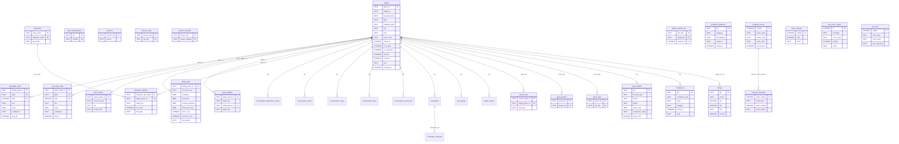

# Database Schema

## Overview


```mermaid
erDiagram
    objects {
        TEXT game_id PK
        TEXT stable_id
        TEXT payload_hash
        TEXT guid
        TEXT template_guid
        TEXT fqn
        TEXT kind
        TEXT icon_name
        INTEGER string_id
        INTEGER for_export
        INTEGER is_canonical
        INTEGER version
        INTEGER revision
        TEXT json
        INTEGER created_at
    }
    strings {
        TEXT fqn PK
        TEXT locale
        INTEGER id1
        INTEGER id2
        TEXT text
        INTEGER version
    }
    quest_details {
        TEXT fqn PK
        TEXT mission_type
        TEXT faction
        TEXT planet
        TEXT class_code
        TEXT companion_class
        INTEGER step_count
    }
    quest_chain {
        TEXT source_game_id PK
        TEXT target_game_id PK
        TEXT link_type
    }
    quest_npcs {
        TEXT quest_fqn PK
        TEXT npc_fqn PK
    }
    quest_phases {
        TEXT quest_fqn PK
        TEXT phase_fqn PK
    }
    quest_prerequisites {
        TEXT fqn PK
        TEXT variable PK
    }
    missions {
        TEXT mission_fqn PK
        TEXT source
    }
    mission_npcs {
        TEXT mission_fqn PK
        TEXT npc_fqn PK
    }
    mission_rewards {
        TEXT mission_fqn PK
        TEXT reward_variable PK
    }
    disciplines {
        TEXT class_code PK
        TEXT discipline_name PK
        TEXT fqn_prefix
    }
    discipline_abilities {
        TEXT discipline_fqn_prefix PK
        TEXT ability_game_id PK
        TEXT ability_fqn
        INTEGER tier_level
        TEXT slot_type
    }
    talent_abilities {
        TEXT talent_game_id PK
        TEXT talent_fqn
        TEXT ability_game_id PK
        TEXT ability_fqn
    }
    ability_stats {
        TEXT ability_game_id PK
        TEXT resource_pool
        REAL cooldown
        REAL cast_time
        REAL channel_duration
        REAL hard_cast_time
        INTEGER force_cost
        INTEGER resource_cost
        TEXT raw_props
    }
    talent_details {
        TEXT talent_game_id PK
        TEXT resource_pool
        TEXT tier
        TEXT script_hook
    }
    gsf_talent_stats {
        TEXT talent_game_id PK
        TEXT label PK
        INTEGER rank PK
        TEXT unit
        REAL value
        TEXT confidence
        INTEGER stat_id
    }
    gsf_ability_stats {
        TEXT ability_game_id PK
        TEXT label PK
        INTEGER rank PK
        TEXT unit
        REAL value
        TEXT confidence
        INTEGER prop_id
    }
    spawn_runtime_ids {
        TEXT spn_fqn PK
        TEXT target_fqn PK
        INTEGER runtime_id PK
    }
    conquest_objectives {
        TEXT fqn PK
        TEXT category
        TEXT subcategory
        TEXT cadence
        INTEGER string_id
    }
    conquest_events {
        INTEGER ordinal PK
        TEXT event_name
        TEXT planet_code
        TEXT event_kind
        INTEGER record_size
    }
    conquest_schedule {
        INTEGER week_ordinal PK
        TEXT event_guid
        INTEGER event_ordinal
        TEXT event_name
    }
    companions {
        TEXT fqn PK
        TEXT companion_key
        TEXT name
        TEXT category
        INTEGER string_id
        TEXT guid
    }
    armor_classes {
        INTEGER ordinal PK
        INTEGER code
        TEXT name
    }
    stat_curve_values {
        INTEGER id PK
        TEXT prototype
        TEXT curve_hash
        INTEGER ordinal
        REAL value
    }
    gsf_crew {
        INTEGER ordinal PK
        TEXT icon_name
        TEXT crew_name
        TEXT idle_animation
    }

    objects ||--o{ strings : "string_id = id2"
    objects ||--o{ companions : "fqn"
    conquest_events ||--o{ conquest_schedule : "ordinal = event_ordinal"
    objects ||--o| quest_details : "fqn"
    objects ||--o{ quest_npcs : "quest_fqn"
    objects ||--o{ quest_phases : "quest_fqn"
    objects ||--o{ quest_chain : "game_id"
    objects ||--o{ quest_clusters : "fqn"
    objects ||--o| item_details : "fqn"
    objects ||--o{ schematics : "fqn"
    schematics ||--o{ schematic_materials : "schematic_fqn"
    objects ||--o{ conversation_quest_refs : "fqn"
    objects ||--o{ conversation_npcs : "fqn"
    objects ||--o{ conversation_codex : "fqn"
    objects ||--o{ conversation_items : "fqn"
    objects ||--o{ conversation_alignment_events : "fqn"
    objects ||--o{ discipline_abilities : "game_id"
    objects ||--o{ talent_abilities : "game_id"
    objects ||--o| ability_stats : "game_id"
    objects ||--o| talent_details : "game_id"
    objects ||--o{ gsf_talent_stats : "game_id"
    objects ||--o{ gsf_ability_stats : "game_id"
    disciplines ||--o{ discipline_abilities : "fqn_prefix"
```

## Core tables

### objects

Every game object extracted from GOM payloads. The single source of truth for all abilities, items, NPCs, quests, talents, and other types.

**Three-id model** (each column has a distinct purpose; do not conflate them):

| Column | Type | Formula | Property | Use |
|---|---|---|---|---|
| `game_id` | TEXT PK | `sha256(fqn:guid)[0:16]` | Unique per object-instance per extraction. Shifts on patch (because GUID does). | All FKs, joins, and consumer keys for the current extraction. |
| `stable_id` | TEXT | `sha256(fqn)[0:16]` | Stable across patches; unique only post-`mark_canonical_by_fqn`. | Cross-version delta joins (`USING (stable_id)`) to find "the same object across two extractions" even when GUID has shifted. |
| `payload_hash` | TEXT | `sha256(payload_bytes)[0:16]` | Not an identity. Tracks "did this object's data change." | Delta filter: `WHERE old.payload_hash != new.payload_hash` after joining on `stable_id`. |

**Other columns:**

| Column | Type | Description |
|--------|------|-------------|
| `guid` | TEXT | 16-char uppercase hex from GOM header bytes 0–7 (LE u64). The raw content GUID from the binary. Shifts on patch — kept as a forensic / change-signal column, no longer the PK. |
| `template_guid` | TEXT | 16-char hex from header bytes 16–23. Constant per kind (~99% of the time). |
| `fqn` | TEXT | Fully qualified name, e.g. `abl.sith_warrior.force_charge`. Dot-separated, prefix determines kind. |
| `kind` | TEXT | Object type: `Ability`, `Item`, `Npc`, `Quest`, `Talent`, `Phase`, `Codex`, `Achievement`, `Conversation`, `Encounter`, `Spawn`, `Placeable` |
| `icon_name` | TEXT | SWTOR DDS basename (without `.dds`). Matched to icon files during extraction. NULL if no icon found. |
| `string_id` | INTEGER | Links to `strings.id2` for localized name/description lookup. |
| `for_export` | INTEGER | 1 = include in consumer exports, 0 = internal only. |
| `is_canonical` | INTEGER | 1 = the chosen "best" row for this FQN; 0 = inferior variant kept for delta tooling and forensics. The same FQN can appear under multiple GUIDs in raw GOM extraction (canonical objects + stub references). `mark_canonical_by_fqn` picks one row per FQN by quality heuristic (non-NULL string_id, then non-NULL icon_name, then larger json, then guid ASC) and demotes the rest. **Default consumer queries should filter `WHERE is_canonical = 1`.** Inferior variants are intentionally retained — earlier kessel versions DELETE'd them, which lost data delta tooling now needs. |
| `json` | TEXT | Full extracted metadata as JSON. Includes `fqn`, `header_hex`, `payload_b64`, `strings`, `string_id`. |
| `created_at` | INTEGER | Unix epoch at insert time. |

**Why game_id is compound:** Neither field is unique-and-stable on its own. FQN is not unique in raw extraction (canonical + stubs share an FQN; uniqueness only emerges post-`mark_canonical_by_fqn`). GUID shifts on patch. The compound `sha256(fqn:guid)` is unique per extraction by construction (every GOM object has a unique GUID in the binary, and pairing with FQN is just additional disambiguation). For cross-patch identity, use `stable_id` — that's the column whose entire purpose is to survive a patch.

**Views:** `abilities`, `items`, `npcs`, `quests`, `phases` — each filters `objects` by kind **and** `is_canonical = 1`. Consumer queries hitting raw `objects` should add the canonical filter explicitly; queries against the views already have it.

**Foreign keys.** Every junction table's `*_game_id` column declares `FOREIGN KEY ... REFERENCES objects(game_id)`. SQLite enforcement is per-connection (`PRAGMA foreign_keys = ON`). kessel ships the declarations as schema documentation — turn the pragma on in your consumer connection if you want runtime enforcement.

### strings

Localized text extracted from STB string tables.

| Column | Type | Description |
|--------|------|-------------|
| `fqn` | TEXT PK | String path, e.g. `str.abl.sith_warrior.force_charge`. |
| `locale` | TEXT | Locale code, e.g. `en-us`. |
| `id1` | INTEGER | STB row ID. Different id1 values for the same id2 represent different text fields (name, description, etc.). |
| `id2` | INTEGER | Links to `objects.string_id`. |
| `text` | TEXT | Display text, cleaned of SWTOR template syntax by grammar rules. |

**Joining objects to strings:**

```sql
SELECT o.fqn, s.text
FROM objects o
JOIN strings s ON s.id2 = o.string_id AND s.locale = 'en-us'
WHERE o.kind = 'Ability'
  AND s.id1 = 0;
```

id1 mapping varies by object kind:

| Kind | Name | Description / steps |
|------|------|----------------------|
| Ability, Item, Npc, Talent, Achievement, Codex | `id1 = 0` | `id1 = 1` |
| Quest (`qst.*` / `mpn.*`) | `id1 = 88` | step descriptions at `id1 = 258`, `259`, `274+` (range ~200–600) |

The `quest_descriptions` view selects the first quest description string in the 200–600 range. For non-quest objects, join on `id1 = 0` for name and `id1 = 1` for description.

---

## Quest tables

### quest_details

Structured metadata derived from quest FQN and payload analysis.

| Column | Type | Description |
|--------|------|-------------|
| `fqn` | TEXT PK | Quest FQN. |
| `mission_type` | TEXT | `class`, `planet`, `flashpoint`, `operation`, `heroic`, `bonus`, `daily`, `weekly`, `event`, `gsf`, `unknown` |
| `faction` | TEXT | `republic`, `empire`, `neutral`, NULL |
| `planet` | TEXT | Planet slug, e.g. `tython`, `dromund_kaas`. NULL if not planet-specific. |
| `class_code` | TEXT | `jedi_knight`, `sith_warrior`, etc. NULL if not class-specific. |
| `step_count` | INTEGER | Number of quest steps extracted from payload. |

### quest_chain

Directed edges connecting quests in sequence. Multiple extraction passes contribute different `link_type`s.

| Column | Type | Description |
|--------|------|-------------|
| `source_game_id` | TEXT | `game_id` of the quest that links outward. |
| `target_game_id` | TEXT | `game_id` of the quest being linked to. |
| `link_type` | TEXT | One of: `guid_ref`, `planet_transition`, `fqn_arc_order` |

**link_type semantics:**

- `guid_ref` — Real CF GUID reference embedded in the source quest's payload pointing at the target. In practice mostly bonus-mission attachments (~157 edges in 7.8.1.c).
- `planet_transition` — Derived from `leaving_<planet>` quest strings; bridges class-story planet transitions.
- `fqn_arc_order` — Derived from FQN segment ordering. For each `(faction, class)` bucket, every `qst.location.open_world.<faction>.act_N.<class>.*` quest links to every `act_(N+1)` quest. For each `(exp, planet, faction)` bucket, every `qst.exp.<NN>.<planet>.world_arc.<faction>.hub_N.*` quest links to every `hub_(N+1)` quest. Coarse: every-act_N to every-act_(N+1). Captures the act-boundary gate but not within-act ordering. ~390 edges in 7.8.1.c.

Filter `WHERE link_type = 'guid_ref'` for canonical edges only; combine `guid_ref` and `fqn_arc_order` for full story-arc coverage.

### quest_npcs / quest_phases / quest_prerequisites

Junction tables linking quests to related objects.

| Table | Links |
|-------|-------|
| `quest_npcs` | quest → NPCs involved (via encounter/spawn intermediaries) |
| `quest_phases` | quest → `mpn.*` phase objects |
| `quest_prerequisites` | quest → prerequisite variable strings |

Quest rewards are not a separate table: they are covered by `mission_rewards`
(the missions union is a superset of quests), keyed `mission_fqn`. Filter
`WHERE mission_fqn LIKE 'qst.%'` for quest-only rewards.

**Views:**
- `quest_descriptions` — joins quests to their first description string (id1 200–600)
- `bonus_missions` — mpn.*. bonus.* objects with a best-guess parent quest FQN

### quest_clusters

Per-quest cluster assignments for bulk curation. Each quest FQN gets one row per matching `cluster_kind`. A quest can belong to several clusters at different granularities (e.g. a Sith Warrior act_1 quest belongs to both `class_act` and `class_planet`).

| Column | Type | Description |
|--------|------|-------------|
| `quest_fqn` | TEXT | Quest FQN. |
| `cluster_kind` | TEXT | The classification axis (see below). |
| `cluster_id` | TEXT | Pipe-separated bucket key for that axis. |

**cluster_kinds:**

| Kind | FQN pattern | `cluster_id` shape |
|------|-------------|--------------------|
| `class_act` | `qst.location.open_world.<faction>.act_N.<class>.*` | `<faction>\|<class>\|act_N` |
| `class_planet` | `qst.location.<planet>.class.<class>.*` | `<planet>\|<class>` |
| `world_arc_hub` | `qst.exp.<NN>.<planet>.world_arc.<faction>.hub_N.*` | `<NN>\|<planet>\|<faction>\|hub_N` |
| `world_arc` | same | `<NN>\|<planet>\|<faction>` |
| `planet_world` | `qst.location.<planet>.world.<faction>.*` | `<planet>\|<faction>` |
| `expansion_arc` | `qst.exp.<NN>.<planet>.*` (non-world_arc) | `<NN>\|<planet>` |
| `daily_area` | `qst.daily_area.<planet>.*` | `<planet>` |
| `heroic` | `qst.heroic.<name>.*` | `<name>` |
| `flashpoint` | `qst.flashpoint.<name>.*` | `<name>` |
| `operation` | `qst.operation.<name>.*` | `<name>` |
| `event` | `qst.event.<event>.*` | `<event>` |
| `alliance` | `qst.alliance.<arc>.*` (non-companion) | `<arc>` |
| `companion` | `qst.alliance.companion.<class>.*` | `<class>` |
| `qtr` | `qst.qtr.<leaf>` | `<leaf>` |
| `ventures` | `qst.ventures.<leaf>` | `<leaf>` |
| `galactic_seasons` | `qst.exp.galactic_seasons.<season>.*` or `qst.event.galactic_seasons.<season>.*` | `<season>` |

**Curation example** — sweep all Makeb imperial world-arc quests as one unit:

```sql
SELECT q.fqn, qd.mission_type
FROM quest_clusters qc
JOIN objects q ON q.fqn = qc.quest_fqn
LEFT JOIN quest_details qd ON qd.fqn = qc.quest_fqn
WHERE qc.cluster_kind = 'world_arc'
  AND qc.cluster_id = '01|makeb|imperial';
```

---

## Mission tables

Missions are the union of `qst.*` and `mpn.*` objects.

### missions

| Column | Type | Description |
|--------|------|-------------|
| `mission_fqn` | TEXT PK | FQN of the mission (qst.* or mpn.*). |
| `source` | TEXT | `qst` or the mpn prefix. |

### mission_npcs / mission_rewards

Same shape as `quest_npcs` but scoped to the missions union (`qst.*` + `mpn.*`).
`mission_rewards` is the canonical reward-variable table; it is a superset of
quest rewards (every `qst.*` reward appears here under its `mission_fqn`).

---

## Discipline tables

### disciplines

One row per discipline (advanced class specialization).

| Column | Type | Description |
|--------|------|-------------|
| `class_code` | TEXT | e.g. `sith_inquisitor`, `jedi_knight` |
| `discipline_name` | TEXT | e.g. `hatred`, `deception`, `darkness` |
| `fqn_prefix` | TEXT | Ability FQN prefix for this discipline, e.g. `abl.sith_inquisitor.skill.hatred` |

### discipline_abilities

Ability slots within a discipline, ordered by tier.

| Column | Type | Description |
|--------|------|-------------|
| `discipline_fqn_prefix` | TEXT | Links to `disciplines.fqn_prefix`. |
| `ability_game_id` | TEXT | Links to `objects.game_id`. |
| `ability_fqn` | TEXT | Ability FQN for direct lookup. |
| `tier_level` | INTEGER | Unlock level within the discipline (15, 23, 39, 43, 51, 64, 68, 73). |
| `slot_type` | TEXT | `active`, `passive`, `stance`, `buff` |

### talent_abilities

Abilities granted or modified by talents (passive skill nodes).

| Column | Type | Description |
|--------|------|-------------|
| `talent_game_id` | TEXT | Links to `objects.game_id` for the `tal.*` object. |
| `talent_fqn` | TEXT | Talent FQN. |
| `ability_game_id` | TEXT | 16-char hex GUID from talent payload — may not be in the objects table. |
| `ability_fqn` | TEXT | Resolved FQN if the GUID matches an extracted object. NULL otherwise. |

### talent_details

Per-talent classification + payload tail-string decode. One row per `tal.*` object.

| Column | Type | Description |
|--------|------|-------------|
| `talent_game_id` | TEXT PK | Links to `objects.game_id`. |
| `resource_pool` | TEXT | Same vocabulary as `ability_stats.resource_pool` (`force` / `rage` / `focus` / `heat` / `ammo` / `energy` / `gsf` / NULL). Derived from the FQN class segment — `tal.sith_warrior.*` resolves to `rage`, `tal.spvp.*` resolves to `gsf`, etc. |
| `tier` | TEXT | The FQN's last segment. Discipline talents use `tier1` / `tier2` / `tier3a` / `tier3b` / `base` / `passive` / etc; GSF talents use `tier1` / `tier_2` / `tier_3a` / `tier_3b` / `tier_4a` / `tier_5b`. Both forms appear in source data; the column preserves whatever the FQN carries. |
| `script_hook` | TEXT | Length-prefixed ASCII identifier at the payload tail (vault MAPPINGS.md lines 339-365). Identifies the underlying ability mod the talent triggers. Examples: `abl_bh_me_kolto_shot`, `spvp_reducedcooldown`, `spvp_increasedsystemsdamagechance`, `iamilitaryofficer`. ~94% of talents have one; NULL for the rest. Useful as a join key when the same hook is referenced by multiple talents (cross-class proc identifiers). |

### ability_stats

Properties decoded from the canonical `abl.*` payload prop block. The dominant ability template (~86% of `abl.*`) writes its property table as a contiguous run of 6-byte `[u16 LE prop_id][f32 LE value]` records starting at the sentinel `01 04 00 00 80 BF` (= 0x0401 with -1.0, an uninit marker) and ending where the next 2 bytes are not in 0x04xx. The walker reads only that block.

A row is populated for every `abl.*` object whose FQN class resolves a `resource_pool`, even if its payload has no prop block (secondary template — companion / racial / legacy / on-rails Space Combat / GSF (`abl.spvp.*`) / passive abilities).

| Column | Type | Prop ID | Description |
|--------|------|---------|-------------|
| `ability_game_id` | TEXT PK | — | Links to `objects.game_id`. |
| `resource_pool` | TEXT | — | One of `force`, `rage`, `focus`, `heat`, `ammo`, `energy`, `gsf`. Derived from FQN class segment. `gsf` tags Galactic Starfighter abilities (`abl.spvp.*`) — GSF has a distinct 3-pool stat system, the tag identifies the game mode. NULL for companion / racial / legacy abilities and on-rails Space Combat (`abl.space_combat.*`). |
| `cooldown` | REAL | 0x0401 | Cooldown in seconds. |
| `cast_time` | REAL | 0x041b | Activation time (cast or channel) in seconds. |
| `channel_duration` | REAL | 0x0406 | Channel duration in seconds. Matches `cast_time` for channels. |
| `hard_cast_time` | REAL | 0x041a | Alternate cast time prop seen on some abilities. |
| `force_cost` | INTEGER | 0x0403 | Force-pool cost for sorcerer/sage abilities. Tech abilities also write 0x0403 at low values (1.0) as a scaling coefficient — the column drops values below 5 so this never lands as a cost. |
| `resource_cost` | INTEGER | 0x041e | Heat / energy / ammo cost for tech abilities. Threshold ≥ 1 to drop sub-unit noise. |
| `raw_props` | TEXT | — | JSON map of every in-block 0x04xx record `{"0xNNNN": f32, ...}` including unknowns (0x0402 universal animation marker, 0x041d, 0x041f, 0x0420, 0x0421 — class-context-dependent). |

**Resource pool by class:**

| FQN class segment | resource_pool |
|---|---|
| `sith_warrior` | rage |
| `jedi_knight` | focus |
| `sith_inquisitor` | force |
| `jedi_consular` | force |
| `bounty_hunter` | heat |
| `trooper` | ammo |
| `agent` | energy |
| `smuggler` | energy |
| `spvp` (Galactic Starfighter) | gsf |
| anything else (companion / racial / legacy / on-rails Space Combat) | NULL |

**Coverage caveats:**
- ~14% of `abl.*` (459 rows on template `4000000002754EE0`, including `shock`, `endure_pain`, `takedown`, all companions/racials) have no prop block. They get a row only if `resource_pool` resolves; cooldown/cast/cost columns are NULL.
- Rage and focus costs are not in this prop block — warrior/knight ability cost lives elsewhere in the payload (effect graph) and is not yet decoded. `force_cost` and `resource_cost` will be NULL for warrior/knight abilities even when they have one.

### gsf_talent_stats

Numeric stat values decoded from `tal.spvp.*` (Galactic Starfighter talent) GOM payloads. The values huttspawn's GSF mechanic diagrams need: firing-arc degrees, tracking-penalty %, cooldown deltas, lock-on time reductions, range and radius modifiers, etc. Records have shape `[c9 01]? <stat_id:u8> 01 04 <f32 LE>` and end at the signature `cb 19 d7 4b ?? 03`. The `ability_stats` extractor anchors on a sentinel (`01 04 00 00 80 BF`) that GSF talents do not carry, so it cannot reach this data — `gsf_talent_stats` is a separate decoder.

One row per record. `(talent_game_id, label, rank)` is the primary key; `rank` preserves payload order so rank-progression talents (e.g. `engine_power_regen.upgrade` emitting +4% / +8% / +12% as three records of the same stat) and per-effect duplicates remain distinguishable.

Coverage: 250/350 talents (71%). The remaining ~100 are flag-only effects whose values live on the parent ability or in script hooks.

| Column | Type | Description |
|--------|------|-------------|
| `talent_game_id` | TEXT PK | Links to `objects.game_id`. |
| `label` | TEXT PK | Plain-English stat name from `gsf_stat_dictionary.toml` (e.g. `cooldown_delta_seconds`, `firing_arc_degrees`, `tracking_penalty_reduction_percent`). For unknown stat IDs the label is synthesised as `unknown_0x<id>` so the row is still queryable. |
| `rank` | INTEGER PK | 0-based payload-order index for this `(talent_game_id, label)` pair. Most rows are `rank = 0`; rank progressions emit 0, 1, 2 in payload order. |
| `unit` | TEXT | Plain unit token: `seconds`, `percent`, `degrees`, `meters`, etc. Empty string for dimensionless / unknown. |
| `value` | REAL | Decoded f32 LE value. |
| `confidence` | TEXT | `verified` (anchor verified against in-game behavior), `guess` (cross-referenced but unconfirmed), or `unknown` (synthesised label). Filter to `confidence = 'verified'` for trusted-only data. |
| `stat_id` | INTEGER | Raw u8 stat ID (kept for forensics). High-confidence mappings: `0x40` cooldown delta seconds, `0x41` duration extension seconds, `0x47` engine power pool %, `0x48` turning rate %, `0x49` blaster damage %, `0x4b` damage to shields %, `0x4f` tracking penalty reduction %, `0x5c` lock-on time reduction %, `0x5f` firing arc degrees, `0x62` ammo / magazine capacity %, `0x68` sensor radius (~250m units), `0x69` critical hit chance %. |

**Index:** `idx_gsf_talent_stats_label` on `(label)` for stat-keyed pivots.

### gsf_ability_stats

Numeric stat values decoded from `abl.spvp.*` (GSF base ability) GOM payloads. Reuses the `[u16 LE prop_id][f32 LE value]` layout that ground abilities use, but without the `01 04 00 00 80 BF` cooldown sentinel that anchors `ability_stats` and with records scattered across the payload rather than packed contiguously. The decoder walks every 6-byte window and emits any record whose `prop_id` high byte is `0x04` and whose value is finite, non-zero, and in `|v| in [0.01, 100_000]` (subnormal-ish and huge magnitudes are byte-alignment noise from GUID / hash bytes).

`prop_id` semantics differ from ground abilities: for GSF, `0x0402 = cooldown seconds`; for ground, `0x0402` is a universal animation marker. The dictionary has a separate `ability_stats` section to keep them disjoint.

Coverage: 112/131 GSF abilities (85%). Uncovered abilities are passive auras whose effects live on a parent activator or in script hooks.

| Column | Type | Description |
|--------|------|-------------|
| `ability_game_id` | TEXT PK | Links to `objects.game_id`. |
| `label` | TEXT PK | Plain-English prop name from `gsf_stat_dictionary.toml`. Verified anchors: `abl.spvp.engine.barrel_roll` → `cooldown_seconds = 30.0`, `abl.spvp.engine.power_dive` → `cooldown_seconds = 15.0`. Unknown prop IDs synthesise as `unknown_0x<id>`. |
| `rank` | INTEGER PK | 0-based payload-order index for this `(ability_game_id, label)` pair. |
| `unit` | TEXT | Plain unit token. |
| `value` | REAL | Decoded f32 LE value. |
| `confidence` | TEXT | `verified` / `guess` / `unknown`. |
| `prop_id` | INTEGER | Raw u16 prop ID (kept for forensics). |

**Index:** `idx_gsf_ability_stats_label` on `(label)` for stat-keyed pivots.

---

## Item tables

### item_details

Per-item classification derived from FQN segments. One row per `kind = 'Item'` object.

| Column | Type | Description |
|--------|------|-------------|
| `fqn` | TEXT PK | Item FQN. |
| `item_kind` | TEXT | `gear`, `mod`, `schematic`, `decoration`, `consumable`, `material`, `mtx`, `npc`, `loot`, `reputation`, `companion`, `custom`, `quest_token`, `test`, `other` |
| `slot` | TEXT | `chest`, `head`, `legs`, `hands`, `feet`, `waist`, `wrists`, `ear`, `implant`, `relic`, `mainhand`, `offhand`, `shield`. NULL for non-wearables. |
| `weapon_type` | TEXT | `lightsaber`, `polesaber`, `blaster`, `cannon`, `vibroknife`, `rifle`, `shotgun`, `sniper`, etc. NULL if not a weapon. |
| `armor_weight` | TEXT | `light`, `medium`, `heavy`. NULL for non-armor. |
| `rarity` | TEXT | `premium`, `prototype`, `artifact`, `legendary` |
| `item_level` | INTEGER | Parsed from `ilvl_NNNN` or `level_NNN` segments. NULL if absent. |
| `source` | TEXT | `flashpoint`, `operation`, `operation_or_flashpoint` (lots), `conquest`, `pvp`, `raid`, `heroic`, `command`, `mtx`, `quest`, `bis`, `random`, `sow` |
| `is_schematic` | INTEGER | 1 for `itm.schem.*`. |
| `crew_skill` | TEXT | `armormech`, `armstech`, `artifice`, `biochem`, `cybertech`, `synthweaving`. NULL if not detectable from FQN. |

**Known gaps:** set name and set bonus require GOM payload parsing and are not yet extracted. ~6,800 items classify as `item_kind='other'` because their top-level FQN segment is outside the known shape (e.g. `itm.setbonus.*`, `itm.endgame_pvp.*`, `itm.legendary.*`, `itm.alliance.*`, `itm.event.*`, `itm.galactic_seasons.*`).

### schematics

Crafting recipes resolved from the companion `schem.*` GOM kind. Each `itm.schem.*` schematic has a `schem.*` companion (no `itm` prefix) whose payload encodes output + materials via CF GUID refs.

| Column | Type | Description |
|--------|------|-------------|
| `schematic_fqn` | TEXT PK | The `itm.schem.*` FQN. |
| `output_fqn` | TEXT | The crafted item's FQN, resolved via CF GUID ref in the schem.* payload. NULL if no resolved output. |
| `output_resolved` | INTEGER | 1 if `output_fqn` matched a real object, 0 otherwise. |

**Coverage:** ~1,933 of ~2,419 schematics resolve cleanly (80%). The strip-prefix convention `REPLACE('itm.schem.', 'schem.')` pairs each itm.schem.* with its companion schem.* by FQN.

### schematic_materials

Materials list per schematic, with quantities.

| Column | Type | Description |
|--------|------|-------------|
| `schematic_fqn` | TEXT | Links to `schematics.schematic_fqn`. |
| `material_fqn` | TEXT | An `itm.mat.*` material FQN. |
| `quantity` | INTEGER | How many of this material the recipe needs (1–99). |

**Recipe lookup:**

```sql
SELECT s.output_fqn,
       sm.material_fqn,
       sm.quantity
FROM schematics s
JOIN schematic_materials sm ON sm.schematic_fqn = s.schematic_fqn
WHERE s.schematic_fqn = 'itm.schem.gen.quest_imp.rdps1.chest.heavy.premium.03x1_craft';
```

### item_rating_table / item_budget_table / item_modifier_packages

SWTOR item stats are *computed*, not stored per item. An item object carries only three inputs (base level, quality, modifier-set id); these three lookup tables turn that into numbers. They are decoded from the `itmRatingTablePrototype` / `itmBudgetedAttributesPrototype` / `itmModifierPackageTablePrototype` singletons via the typed-value GOM reader (`kessel::gom_reader`).

The formula:

```
rating = item_rating_table[item_level][quality]
stat_s = item_budget_table[quality][item_level][ package.permille(s) ]
```

`item_rating_table` -- 2,010 rows (201 levels x 10 qualities).

| Column | Type | Description |
|--------|------|-------------|
| `item_level` | INTEGER | Item level 0..200. |
| `quality` | TEXT | `cheap`, `standard`, `premium`, `prototype`, `artifact`, `legendary`, `legacy`, `quest`, `currency`, `moddable`. |
| `rating` | INTEGER | Item rating for that level+quality. PK `(item_level, quality)`. |

`item_budget_table` -- ~800k rows (4 qualities x ~200 levels x 1000 permille slots).

| Column | Type | Description |
|--------|------|-------------|
| `quality` | TEXT | `premium`, `prototype`, `artifact`, `legendary` (the only qualities the budget curve carries). |
| `item_level` | INTEGER | Item level (list position 0..199). |
| `permille` | INTEGER | Budget slot index 0..999 (0.1% steps); a modifier package selects which permille feeds each stat. |
| `value` | INTEGER | Stat budget at that slot. PK `(quality, item_level, permille)`. |

`item_modifier_packages` -- 3,635 rows. The stat split per modifier set.

| Column | Type | Description |
|--------|------|-------------|
| `mod_id` | INTEGER | Modifier set id (an item's `itmModifierSetID`). |
| `stat_index` | INTEGER | STAT enum index (zero-based). |
| `stat_name` | TEXT | STAT enum member name, e.g. `STAT_att_mastery`, `STAT_att_endurance`. |
| `permille` | INTEGER | Permille this stat receives from the slot budget. PK `(mod_id, stat_index)`. |

**Oracle:** `item_budget_table` at `quality='artifact'`, `item_level=89` contains the known artifact relic magnitudes 484 and 167.

**Known gap (follow-up):** the per-item link is not yet materialized -- kessel does not yet emit each item's own `(item_level, quality, modifierSetID)` columns, so joining a specific `itm.*` row to these tables requires that decode (item object payloads are CF40-marker structured, unlike the clean singletons).

### item_granted_abilities

The ability/proc an item grants when equipped. Decoded from the item payload's granted-ability field (GOM field id low32 `0x2d7b8786`, a UInt64 object guid), resolved against `objects.guid`.

| Column | Type | Description |
|--------|------|-------------|
| `item_fqn` | TEXT PK | The granting item's FQN. |
| `item_game_id` | TEXT | The item's `objects.game_id`. |
| `ability_guid` | TEXT | The granted ability's object guid (16 hex). |
| `ability_fqn` | TEXT | Resolved ability FQN, when the ability is an extracted object. NULL otherwise. |
| `ability_kind` | TEXT | Resolved object kind. NULL when unresolved. |
| `effect_text` | TEXT | The ability's `id1=1` effect description, when resolved. NULL otherwise. |

3,831 items grant an ability. 535 resolve to extracted abilities with effect text -- every legendary implant and tactical (e.g. Fearless Victor -> "Whenever you use a rage spending damage ability, your melee damage is increased by 10% for 10 seconds") plus set-bonus abilities.

**Known gap (follow-up):** the other ~3,296 (relic procs and similar) reference UNNAMED effect objects that `should_extract_object`'s FQN-prefix whitelist drops. Their `ability_guid` is recorded but `ability_fqn`/`effect_text` are NULL. Resolving relic proc text requires capturing those guid-referenced unnamed effect objects during extraction, then joining their `str.abl.*` effect strings (which already exist in the `strings` table -- e.g. the "Power Surge" proc buff -- but carry runtime-substituted duration/ICD tokens that render blank).

### item_stats

Each item's actual stat block -- the numbers a tooltip shows. One row per (item, stat); the item metadata (level, quality, rating) is denormalized onto every row so a tooltip is a single `WHERE item_fqn=?`.

| Column | Type | Description |
|--------|------|-------------|
| `item_fqn` | TEXT | The item's FQN. |
| `item_game_id` | TEXT | The item's `objects.game_id`. |
| `item_level` | INTEGER | `itmBaseLevel` (internal level, not the display rating). |
| `quality` | TEXT | `itmBaseQuality` (premium / prototype / artifact / legendary / ...). |
| `rating` | INTEGER | Display item rating (e.g. 340, 344). |
| `stat_index` | INTEGER | STAT enum index. |
| `stat_name` | TEXT | STAT enum member (e.g. `STAT_att_mastery`, `STAT_rtg_attack_power`). PK `(item_fqn, stat_index)`. |
| `value` | INTEGER | Stat amount. |

Decoded from the item payload's `itmEquipModStats` field (GOM field id low32 `0xa4faffdd`, a `Map<STAT-enum, value>`; values are whole numbers stored as f32). 58,030 items, 182,511 stat rows.

**Validated against live worn gear:** Fearless Victor implant (rating 340 -> Mastery 1223 / Endurance 1450 / Power 940 / Critical 614), Rakata Force-Healer's Robe (344) and Med-Tech Vambraces all reproduce exactly.

**Design note:** item stats are FIXED, not computed -- no payload carries a `modifierSetID` (field `0xacec47da` is absent on all 113,361 items). The `item_rating_table` / `item_budget_table` / `item_modifier_packages` tables are for theorycrafting the budget curve, not for per-item display. Moddable shells produce no `item_stats` rows (their stats come from slotted mods, which are themselves items with their own `item_stats`).

---

## Conversation tables

NODE prototype files (`/resources/systemgenerated/prototypes/<num>.node`) hold full `cnv.*` conversation playback data. The PROT header carries the cnv FQN; the body contains CF E0 GUID refs that resolve to other game objects, plus alignment-event tokens encoded as audio/effect strings. A single archive scan extracts all of this.

### conversation_quest_refs

| Column | Type | Description |
|--------|------|-------------|
| `cnv_fqn` | TEXT | The conversation FQN (from PROT header). |
| `quest_fqn` | TEXT | The quest the conversation grants/affects. |

Join with `conversation_npcs` to find NPC givers for a quest:

```sql
SELECT DISTINCT cn.npc_fqn AS giver
FROM conversation_quest_refs cqr
JOIN conversation_npcs cn ON cn.cnv_fqn = cqr.cnv_fqn
WHERE cqr.quest_fqn = 'qst.location.hoth.class.spy.assault_on_the_starbreeze';
```

### conversation_npcs

NPC actors participating in each dialog. Largest junction table from NODE extraction (~25,800 rows).

| Column | Type | Description |
|--------|------|-------------|
| `cnv_fqn` | TEXT | Conversation FQN. |
| `npc_fqn` | TEXT | An NPC participating in the dialog. |

### conversation_codex / conversation_items

Codex entries unlocked and items granted by the conversation.

| Column | Type | Description |
|--------|------|-------------|
| `cnv_fqn` | TEXT | Conversation FQN. |
| `codex_fqn` / `item_fqn` | TEXT | Resolved target FQN. |

### conversation_achievements / conversation_followups / conversation_encounters

Tables exist but are empty in current data — achievements / sequel-conversations / triggered encounters are not encoded as direct CF E0 GUID refs in conversation bytes. Retained for future investigation; expect them to remain empty until a different mechanism is decoded.

### conversation_alignment_events

Per-conversation counts of alignment-event tokens found in NODE bytes. SWTOR encodes alignment-coded dialog beats as audio/effect event strings. The presence and count of each kind is a coarse signal for the LS/DS/influence character of a dialog.

| Column | Type | Description |
|--------|------|-------------|
| `cnv_fqn` | TEXT | Conversation FQN. |
| `event_kind` | TEXT | See table below. |
| `event_count` | INTEGER | Number of distinct numbered variants of this kind found in the conversation (e.g. a dialog with `event.darkmoment_07` and `event.darkmoment_15` produces `event_kind='darkmoment'` with `event_count=2`). |

**event_kind taxonomy:**

| event_kind | Source token family | Meaning |
|---|---|---|
| `darkmoment` | `event.darkmoment_NN` | Small DS choice trigger |
| `bigdarkmoment` | `event.bigdarkmoment_NN` | Major DS choice trigger |
| `sinistermoment` | `event.sinistermoment_NN` | DS choice trigger |
| `darksidetheme` | `event.darksidetheme.*` | DS music theme setter |
| `heroicmoment` | `event.heroicmoment_NN` | LS choice trigger |
| `lightsidetheme` | `event.lightsidetheme.*` | LS music theme setter |
| `alignment_override` | `alignment_override` | Explicit alignment override (test/utility convs) |
| `influence_desync` | `influence_desync` | Companion influence event |
| `affection_bot` | `affection_bot` | Companion affection-bot reaction |

**Known limit:** per-choice magnitudes (LS+50/+100, +X/-Y influence) are not yet decoded. The numbered variants (`darkmoment_07`, `darkmoment_29`, etc) likely tier by magnitude but the mapping is not yet established.

**Find DS-heavy conversations:**

```sql
SELECT cnv_fqn, event_count
FROM conversation_alignment_events
WHERE event_kind IN ('darkmoment', 'bigdarkmoment', 'sinistermoment')
  AND event_count >= 5
ORDER BY event_count DESC;
```

---

## Other tables

### conquest_objectives

| Column | Type | Description |
|--------|------|-------------|
| `fqn` | TEXT PK | Conquest objective FQN. |
| `category` | TEXT | `chapter`, `class`, `crafting`, `event`, `flashpoint`, `galactic_seasons`, `location`, `operation`, `spvp`, `uprisings`, `quest`, `weekly` |
| `subcategory` | TEXT | e.g. `tatooine` (location), `bounty_hunter` (class) |
| `cadence` | TEXT | `weekly`, `daily`, NULL |
| `string_id` | INTEGER | Links to strings. |

**Views:** `conquest_invasion_bonuses`, `conquest_theme_strings`

### conquest_events

The conquest event roster, decoded from the `cnqConquestInfoPrototype` singleton. One row per event (90).

| Column | Type | Description |
|--------|------|-------------|
| `ordinal` | INTEGER PK | Event index in the singleton (also the FK target for `conquest_schedule.event_ordinal`). |
| `event_name` | TEXT | e.g. `Yavin`, `Onderon`, `Corellia`. |
| `planet_code` | TEXT | `_pla_<planet>` code, NULL if absent. |
| `event_kind` | TEXT | `invasion` (single-planet, ~68-80B record) or `themed` (multi-bonus special, ~7700-8400B). |
| `record_size` | INTEGER | Raw record byte size. For the final record this is an upper bound (absorbs the singleton's trailing array); `event_kind` uses a gap-centered threshold so it is not mis-tagged. |

### conquest_schedule

The weekly conquest rotation, decoded from the `cnqSchedulePrototype` singleton. 496 consecutive weekly entries.

| Column | Type | Description |
|--------|------|-------------|
| `week_ordinal` | INTEGER PK | Relative week index (1001..1496, consecutive). **Not a calendar date** — the schedule carries no epoch anchor; this is rotation order. Pin one known week to derive the calendar. |
| `event_guid` | TEXT | 8-byte event GUID the schedule references (hex). |
| `event_ordinal` | INTEGER | FK to `conquest_events.ordinal`; NULL when the GUID does not resolve. |
| `event_name` | TEXT | Denormalized event name (join convenience); NULL when unresolved. |

```sql
SELECT cs.week_ordinal, ce.event_name, ce.planet_code
FROM conquest_schedule cs JOIN conquest_events ce ON ce.ordinal = cs.event_ordinal
ORDER BY cs.week_ordinal;
```

### spawn_runtime_ids

Maps spawn objects to their runtime NPC IDs. Used to resolve NPC links in quest payloads.

### companions

The companion roster, from `npc.companion.*` objects with display names resolved from `strings` (`id2 = string_id`, `id1 = 0`, en-us). ~287 rows.

| Column | Type | Description |
|--------|------|-------------|
| `fqn` | TEXT PK | e.g. `npc.companion.smuggler.corso_riggs`. |
| `companion_key` | TEXT | Final FQN segment, e.g. `corso_riggs`. |
| `name` | TEXT | Display name, e.g. `Corso Riggs`. NULL if unresolved. |
| `category` | TEXT | FQN segment after `npc.companion.` — a class (`smuggler`, `jedi_knight`, `sith_warrior`, `bounty_hunter`, `spy`, `sith_sorcerer`, `jedi_wizard`, `trooper`) for origin-class companions, or a content source (`alliance`, `mtx`, `kotet`, `kotfe`, `galactic_seasons`, ...). |
| `string_id` | INTEGER | Links to `strings.id2`. |
| `guid` | TEXT | Object GUID. |

Story-state variants (e.g. `corso_riggs` / `corso_riggs_combat`) are distinct objects and each gets a row; dedupe by `name` or filter key suffixes downstream.

### armor_classes

Armor/equipment class taxonomy from the `cbtArmorTablePrototype` singleton. 9 rows.

| Column | Type | Description |
|--------|------|-------------|
| `ordinal` | INTEGER PK | Record index. |
| `code` | INTEGER | Internal class code byte. |
| `name` | TEXT | `medium`, `heavy_droid`, `focus`, `light`, `generator`, `heavy`, `shield_force`, `shield`, `adaptive`. |

### stat_curve_values

Raw per-level shield curve values from the `cbtShieldPerLevel` singleton — literal stored floats, no level/stat semantics (the curve is 2D over an undecoded segment key). Series-separate by `curve_hash`. For prose/chart rendering.

| Column | Type | Description |
|--------|------|-------------|
| `id` | INTEGER PK | Surrogate. |
| `prototype` | TEXT | Source singleton (`cbtShieldPerLevel`). |
| `curve_hash` | TEXT | Enclosing CF40 field-hash (the series discriminator). |
| `ordinal` | INTEGER | Position within `(prototype, curve_hash)`. |
| `value` | REAL | Literal f32 value. |

### gsf_crew

Galactic Starfighter crew roster from the `scffCrewPrototype` singleton. 51 rows. (Asset/animation-derived; see `companions` for the canonical roster.)

| Column | Type | Description |
|--------|------|-------------|
| `ordinal` | INTEGER PK | Record index. |
| `icon_name` | TEXT | `spvp_Crew_icon_<name>` resource string. |
| `crew_name` | TEXT | Icon-prefix-stripped name. |
| `idle_animation` | TEXT | Following idle-animation ref, or NULL. |

---

## Icon lookup

Icons are stored as `{game_id}.webp` under a per-kind subdirectory. Given an object, the CDN path is:

```
/icons/{kind_slug}/{game_id}.webp
```

Where `kind_slug` is the lowercase kind: `abilities`, `items`, `talents`, `npcs`, etc.

**Icon filenames shift on patch.** `game_id` is unique per object-instance per extraction; it changes whenever the underlying GUID changes (which patches do routinely). Icon CDN syncs after every extraction must be treated as a republish, not an additive layer. If you need a stable cross-extraction identity for an object — e.g. for a frontend cache key that survives patches — use `stable_id` (`sha256(fqn)[0:16]`) instead. `game_id` is the right key for icon filenames within a single shipped spice; `stable_id` is the right key for "the same logical object across extractions."
